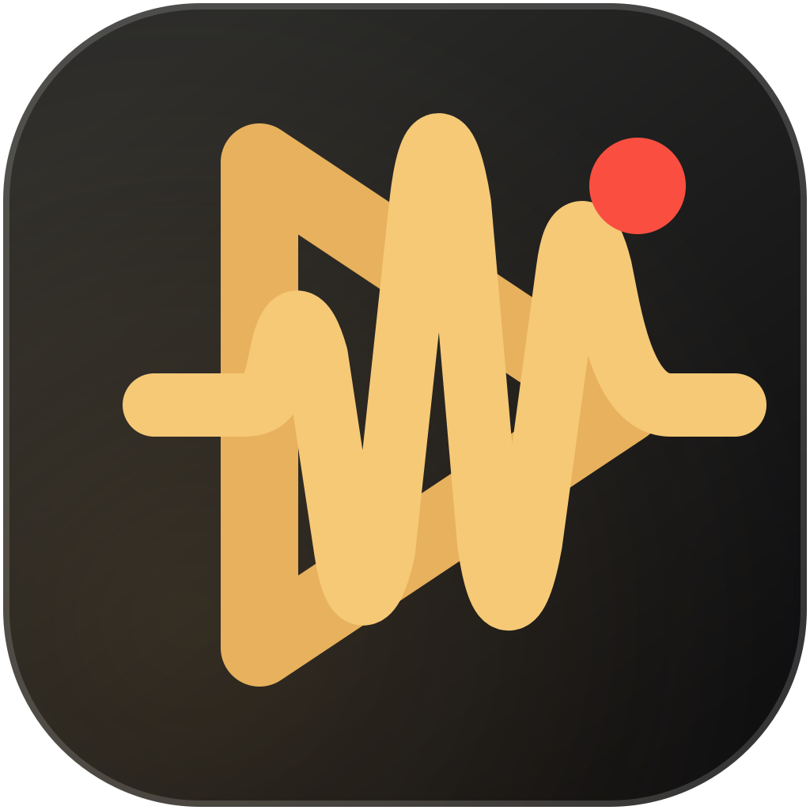

<div align="center">
  
  <h1>NoDays Record</h1>
  <p>A local-first macOS screen recorder for polished demos and tutorials.</p>
  <p>
    <a href="https://github.com/nodaysidle/nodaysrecording/releases/latest">Download the latest release</a>
    ·
    <a href="https://github.com/nodaysidle/nodaysrecording/issues">Report an issue</a>
  </p>
</div>

<p align="center">
  
  
  
  
</p>

NoDays Record is a small, open-source alternative to Screen Studio. It records a real display, window, or selected region, keeps the media library on your Mac, and gives each take a focused editing surface without an account, cloud workspace, or telemetry layer.

## What works today

- Capture an entire display, a visible application window, or a selected area.
- Record microphone audio and configure system audio through ScreenCaptureKit.
- Use a countdown, pause/resume controls, and the global `⌘ ⇧ R` shortcut.
- Save real `.mov` recordings to a local library. The release recordings are H.264 QuickTime-compatible movies.
- Open recordings in the built-in editor with local playback, seeking, zoom markers, background choices, cursor style choices, and caption style choices.
- Generate a local transcript with on-device Speech Recognition when the current macOS language supports it.
- Save recording-style presets locally for reuse.
- Use the bundled NoDays Record logo and native macOS app icon.

## Honest status

NoDays Record is an early release, not a finished Screen Studio replacement. The following parts are intentionally documented instead of presented as complete:

- Face-cam compositing is not enabled in the current capture build.
- Pen, shape, text, and highlight drawing tools are not implemented yet.
- Cursor, background, zoom, and caption controls are currently editor settings/preview behavior; there is no final rendered export pipeline yet.
- Captions are returned as local transcript text; they are not burned into an exported movie.
- Presets are stored and displayed locally; applying a preset directly to a new recording is still a follow-up workflow.

The source app does not bundle sample media. A new install starts with an empty library and only shows movies created on that Mac.

## Privacy model

NoDays Record is local-first by design:

- Recordings live at `~/Library/Application Support/NoDays Record/Recordings`.
- Recording metadata and presets are stored in the same local application-support folder.
- Screen, microphone, camera, and Speech Recognition access are controlled by macOS permissions.
- Captured media, audio, camera frames, and transcript text are not uploaded by the app.
- Export and sharing are explicit actions performed by you.

## Download

Download the Apple Silicon DMG from the [latest GitHub release](https://github.com/nodaysidle/nodaysrecording/releases/latest).

The release is ad-hoc signed and not notarized. On first launch, macOS may require you to right-click the app and choose **Open**, then approve Screen Recording and any optional microphone or Speech Recognition access in **System Settings → Privacy & Security**.

## Build from source

Requirements:

- macOS 15 or newer
- Swift 6.3 toolchain (the project uses Swift Package Manager)
- An Apple Silicon Mac for the published release asset; source builds use the host architecture

From the repository root:

```sh
swift build
Scripts/package_app.sh
Scripts/launch.sh
```

The packaged app is created at `./NoDaysRecord.app` and the native icon is rebuilt from `Resources/NoDaysRecordIcon.svg`.

## Build a DMG

```sh
Scripts/package_dmg.sh
```

The script rebuilds the release app, creates a drag-to-Applications disk image, and writes `dist/NoDaysRecord-0.1.0.dmg`. The staging directory and `dist/` output are ignored by Git.

## Project map

```text
Sources/NoDaysRecord/
├── AppModel.swift                 State, recording lifecycle, permissions
├── Models/Models.swift             Capture, recording, preset, and editor models
├── Services/ScreenCaptureService.swift
├── Services/AreaSelectionController.swift
├── Services/LocalCaptionService.swift
├── Services/LocalStore.swift       Local JSON metadata and movie paths
└── Views/                          SwiftUI recording, editor, settings, and presets UI
Resources/                          SVG logo, PNG source, and generated ICNS icon
Scripts/package_app.sh              Native app bundle and ad-hoc signing
Scripts/package_dmg.sh              Reproducible drag-to-Applications DMG
```

## Verification

The narrow release checks are:

```sh
swift build
Scripts/package_app.sh
Scripts/package_dmg.sh
codesign --verify --deep --strict NoDaysRecord.app
plutil -lint NoDaysRecord.app/Contents/Info.plist
```

The capture paths are best verified on the Mac that owns the required macOS permissions. A successful smoke test should create one local movie for each source and open those movies in QuickTime Player.

## Contributing

Issues and focused pull requests are welcome. Please keep changes local-first, avoid adding telemetry or account requirements, and describe any macOS permission or hardware assumptions in the pull request.

## License

NoDays Record is available under the [MIT License](LICENSE).
